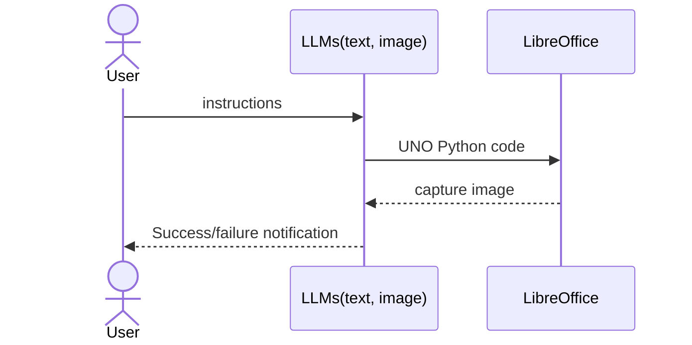

# autospreadsheet
Manipulate spreadsheets(LibreOffice Calc-UNO) with LLM  
1 The first LLM writes the instructions as Universal Network Objects.   
2 It then operates the specified OpenOffice application.  
3 The second LLM evaluates whether the application's output matches the given instructions and sends the evaluation results back to the first LLM.  
4 The first LLM makes improvements based on the feedback provided by the second LLM.   

## How to use  
* Preliminary preparations
    * Ollama (accepted at “http://localhost:11434/api/generate”)
        * Multimodal model (e.g., gemma3; Replace ‘IMAGE_VERIFIER_MODEL’ in 'main.py' with your model and use it.)
* Start the LibreOffice Calc (spreadsheet software) in listening mode  
  `"C:\Program Files\LibreOffice\program\soffice.exe" --calc --accept="socket,host=localhost,port=2002;urp;" --norestore`
* Start **autospreadsheet**  
  `"C:\Program Files\LibreOffice\program\python.exe" "main.py"`

## Data flow

