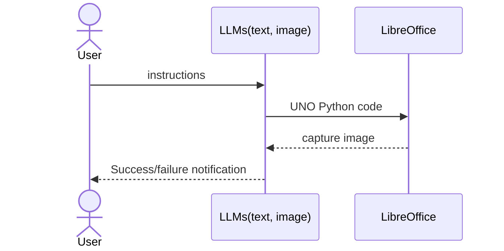

# autospreadsheet
**Let AI Handle Your LibreOffice Calc Tasks and Dramatically Boost Your Productivity**  
This program leverages the power of Large Language Models (LLMs) to automate spreadsheet manipulation and chart creation.

## How It Works:
* You Provide the Instructions: Simply tell the program what you want to do in plain language.  
* The AI Does the Work: Two LLMs collaborate to operate LibreOffice Calc according to your instructions.  
* Self-Correcting: The AI evaluates its own output and automatically makes corrections until the desired result is achieved, ensuring accurate and reliable outcomes.

## How to use:  
* Preliminary preparations
    * Ollama (accepted at “http://localhost:11434/api/generate”)
        * Multimodal model (e.g., gemma3; Replace ‘IMAGE_VERIFIER_MODEL’ in 'config.py' with your model and use it.)
* Start the LibreOffice Calc (spreadsheet software) in listening mode  
  ```sh
  "C:\Program Files\LibreOffice\program\soffice.exe" --calc --accept="socket,host=localhost,port=2002;urp;" --norestore
  ```
* Start **autospreadsheet**  
  ```sh
  "C:\Program Files\LibreOffice\program\python.exe" "main.py"
  ```

## Data flow


## Discussions
https://github.com/l-r-w-250111/autospreadsheet/discussions/1#discussioncomment-14093336  

